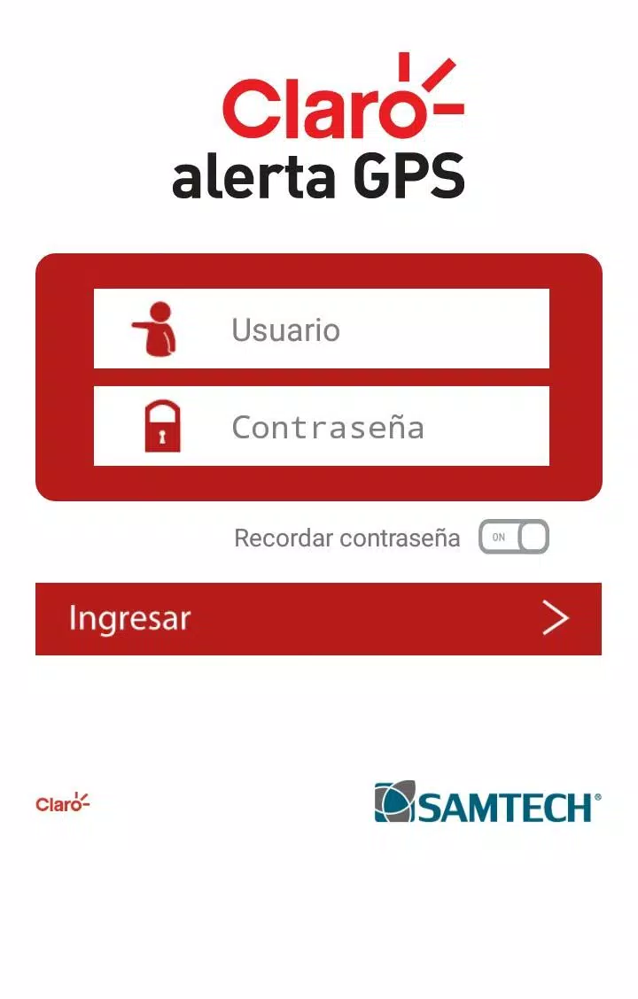
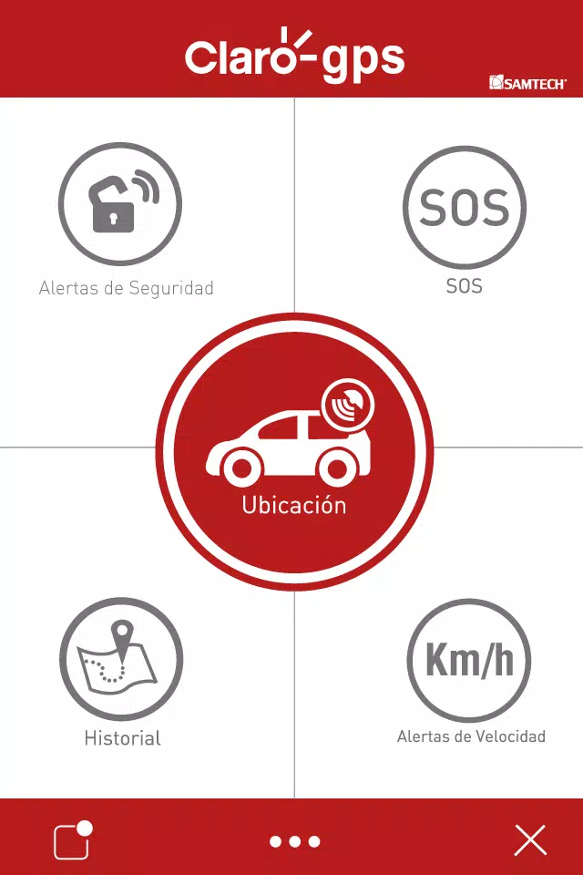
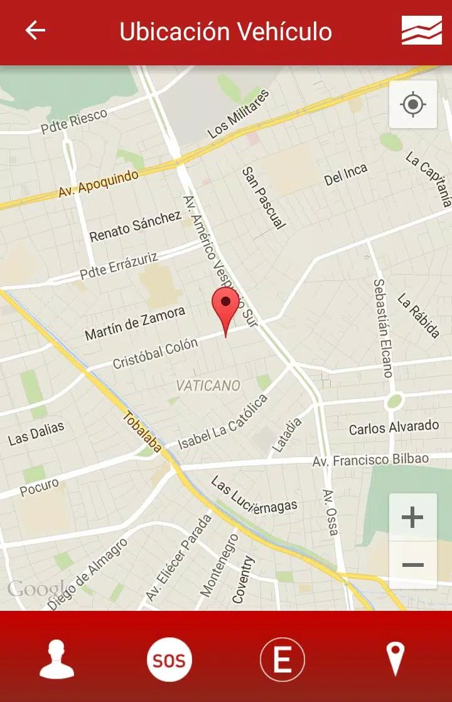

AutoSeguro – Real-Time Vehicle Tracking App

Overview
AutoSeguro is an iOS mobile application for real-time GPS vehicle tracking, enabling users to monitor vehicle locations, receive security alerts, and engage parking protection modes. Built to interface with Samtech GPS hardware installed in vehicles, the app is targeted at logistics and fleet operators seeking mobile visibility and security.

Features
	•	Real-time GPS vehicle location tracking
	•	“Protected Mode” for enhanced theft alerting
	•	“Parked Mode” for stationary vehicle monitoring
	•	Push notifications for security and usage events

Technical Stack
	•	Language: Swift
	•	Framework: Cocoa Touch (UIKit-based native app)
	•	Networking: AFNetworking (v2.6.3) – NSURLConnection and NSURLSession support for REST API consumption
	•	Push Notifications: Native iOS Push (APNs)
	•	Dependency Management: CocoaPods
	•	Deployment Target: iOS 8+

Architecture & Infrastructure
	•	MVC pattern for frontend logic and service orchestration
	•	External Samtech GPS integration via HTTP APIs
	•	Remote data sync and event-driven notifications from cloud GPS service

