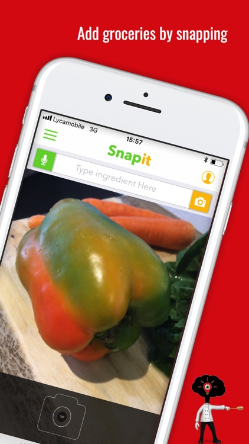
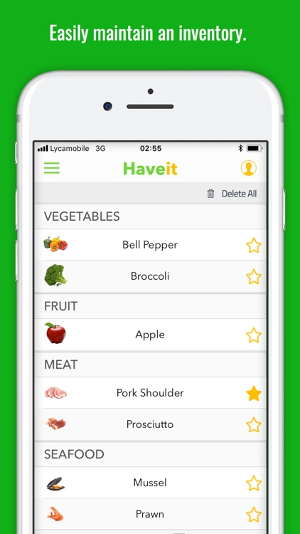

## Scoodit — Smart Ingredient Scanner & Recipe Generator

### Overview

Scoodit is an iOS app that helps users identify ingredients from images or voice input, and generates personalized recipes. It aims to reduce food waste and promote healthier, budget-friendly eating habits.

### Key Features
	•	Image Recognition: Uses Clarifai API to identify ingredients from camera or photo library.
	•	Voice Input: Users can add ingredients via voice.
	•	Personalized Recipes: Suggests recipes based on user preferences, intolerances, and availability.
	•	Shopping Integration: Add missing ingredients to a list or share via SMS/WhatsApp.
	•	Profile-Based Filtering: Filters out ingredients based on user-defined dislikes or allergies.

### Technical Highlights
	•	Language: Swift 3.0
	•	Architecture: MVC (Model-View-Controller)
	•	iOS Version: Minimum iOS 10.0
    •	Google Cloud Vision: Ingredient detection from images
    •	Clarifai: Ingredient detection from images
    •	CoreML: Ingredient detection from images
	•	Dependency Management: CocoaPods
	•	Storage: AWS S3 for media storage
	•	Realm for local persistence
	•	Firebase for user auth and cloud data

### Pods & Libraries
	•	Firebase (Auth, Core, Database, Messaging): Realtime user and data management
	•	AWSS3: Upload/download ingredient photos to S3
	•	RealmSwift: Local data storage
	•	Nuke: Image loading and caching
	•	Alamofire & SwiftyJSON: Networking and API response handling
	•	PMAlertController & Toaster: UI notifications and alerts
	

{: height="200"}
{: height="200"}
{: height="200"}
{: height="200"}
